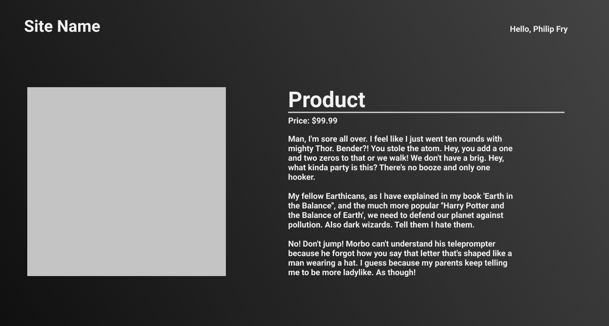
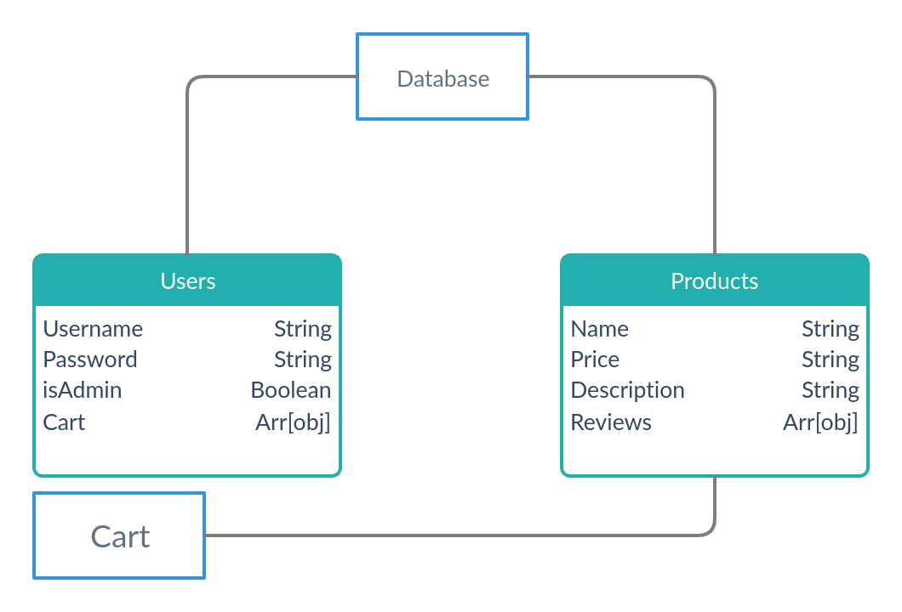

# User Stories

## About the Project

This simple Ecommerce CMS, allows users to view a page of products. Users with Admin rights are able to add, delete, and update products.

## User Stories

### Non Admin Users

- Users are able to view a page showing all products
- Users are able to view a page showing details about an individual object

### Admin Users

- Admins are able to add new products
  - Any product added by an admin will be created by that admin, and will be referenced in the DB
- Admins are able to delete products from the index page, or from an individual product page
- Admins are able to edit products from the product's detail page
- Admins are only able to be created by other Admins

## Wireframes

### ERD

## Technologies Used

- Node.JS
- Express
- MongoDB
- HTML
- CSS
- Javascript

## Accredited Work

### Dmitriy Zagoruyko

- Products
- Model
- Views
- Controller

### Timothy Allgood

- Users
- Model
- Views
- Controller
- Authentication
- CSS
